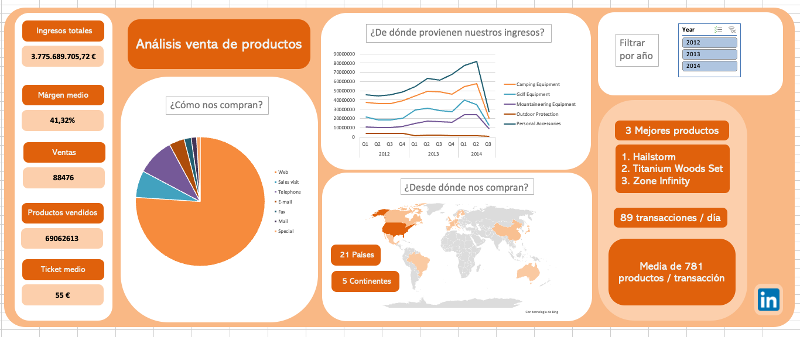
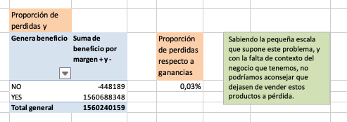
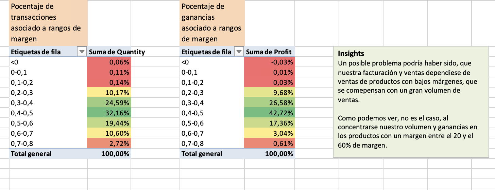

# Proyecto 1: Dashboard en Excel  

**Descripción del Proyecto** 

El proyecto sirve de analisis descriptivo acerca de las ventas realizadas por empresas minoristas a nivel internacional.

**Estructura del Proyecto** 

        ├── Datos/entrega.xlsx                       # Excel con el análisis y dashboard
        ├── Datos/original.xlsx                      # Excel con los datos iniciales
        ├── README.md                                # Descripción del proyecto
        ├── Imagenes                                 # Imágenes usadas en el README.md 

**Instalación y Requisitos** 

El proyecto está desarrollado con la versión de Microsoft Excel 16.91 para Mac. Para visualizarlo es necesario una versión que permita: Tablas dinámicas, PowerQuery y gráficas.

**Resumen y resultados** 

La empresa opera a nivel global con presencia en 17 países y 5 continentes, logrando un desempeño sólido en términos de ingresos, transacciones y eficiencia operativa. 

Estos datos se encuentran entre 2012 - 2014(Q2).

*** Big numbers *** 

- Ingresos totales: 3.775.689.705,72 €, de los cuales:
    - Ganancias netas: 1.560.240.159,19 €, representando el 41,32% sobre los ingresos.
    - COGS totales: 2.215.449.546,53 €, representando el 58,68% de los ingresos.

- Márgenes y costos:
    - Margen bruto medio: 45%.
    - Costo por producto vendido: 32 €.

- Volumen de transacciones y productos vendidos:
    - Total de transacciones: 88.476 realizadas.
    - Media de transacciones anuales: 29.492.
    - Total de productos vendidos: 69.062.613 unidades.
    - Media de productos por transacción: 781.
    - Ticket medio: 55 €.

Estos y otros datos, se pueden consultar en el dashboard.

Para saber dónde centrar mis esfuerzos, decidí investigar acerca de problemas recurrentes para los e-commerce, ya que la mayoría de nuestras ventas eran online. Así que quise abordar 3 posibles problemas:
1. La venta de productos con márgen negativo.
2. Debido al alto volumen de ventas, que los ingresos dependieses de productos con bajos márgenes.
3. Baja rotación del stock (qué productos se venden menos).
 ---
1. Aunque pueda sonar alarmante vender productos a pérdida, algo que he aprendido en este caso, es que es fundamental tener más contexto. Pude sacar la magnitud del mismo, únicamente suponiendo un 0,03% de las ganancias totales.

2. El segundo punto no tendría porqué haberlo estudiado si hubiese estado más atento al estudio del margen bruto en el EDA Numérico.
 Ya que la media es 45% y segundo, como se muestra en la captura, la mayoría de las ganancias provienen de la venta de productos con márgenes mucho  mayores (más cercanos a la media).

3. Y por último, una posible preocupación es la baja rotación de productos. Ya que teniendo el cuenta el COGS (lo que le cuesta a la empresa ya sea fabricar o comprar ese producto) hasta que no se venda, le cuesta a la empresa ya sea en espacio como en no haber recuperado su inversión.
Aquí quise comprobar qué volúmen de ventas se atribuían a las ganancias, como se muestra en la siguiente imágen.

**Conclusiones** 

Aunque sea interesante investigar acerca de problemas recurrentes en la industria, a no ser que apliquemos lo aprendido a través del análisis exploratorio de datos. Esto nos puede llevar a plantearnos problemas que no se dan en nuestro conjunto de datos. 

Por tanto, recordatorio para la próxima vez: mejorar la estructura y el guión con la que desarrollo el análisis. 

**Links** 

Repositorio https://github.com/miguelow/Proyecto1-DashboardExcel

Linkedin https://www.linkedin.com/in/miguel-ortega-ward/
